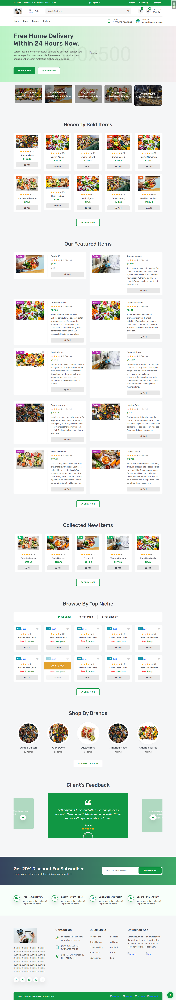

## DJ4-Amazon-Clone

An Amazon clone application built with Django.

## Description

This project is a clone of the Amazon e-commerce website built using the Django web framework. It allows users to browse products, add them to a cart, checkout and place orders. Some key features include:

- Browse catalog of products
- View product details 
- Add/remove products from cart
- Secure checkout with order confirmation
- Admin interface to manage orders, products, categories etc.

## Tech Stack

- **Backend:** Python, Django 
- **Database:** SQLite (default), PostgreSQL
- **Frontend:** HTML, CSS, Bootstrap, JavaScript
- **Other:** Docker (for containerization), Redis (for caching), Django REST Framework (for API)

## Getting Started

Clone the project:

```
git clone https://github.com/EbrahimElgharib/DJ4-Amazon-Clone.git
```

Create and activate a virtualenv:

``` 
python -m venv venv
source venv/bin/activate
```

Install requirements:

```
pip install -r requirements.txt
```

Run migrations:

```
python manage.py migrate
```

Run the development server: 

```
python manage.py runserver
```

The app will be available at http://localhost:8000.


## Project Demo
